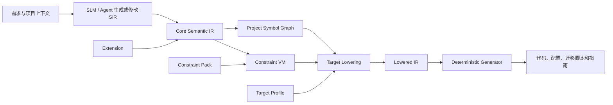
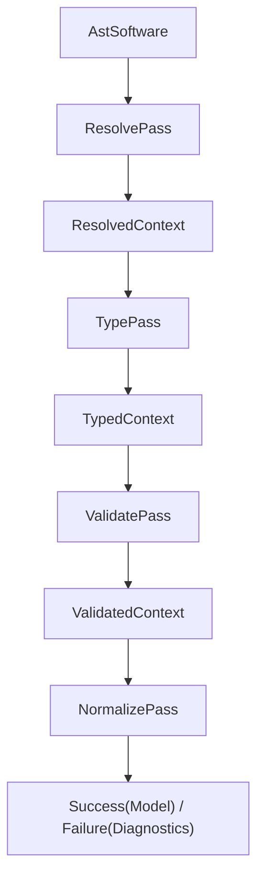

# KCG-Code 系统架构与实现指南

这份文档面向项目所有者和后续开发者。它不假设你有编译器开发经验，重点解释：系统到底在做什么、代码为什么这样分层，以及以后加入 Spring Boot、Redis、算法和项目修改能力时应该接在哪里。

## 1. 用一句话理解 KCG-Code

KCG-Code 想做的不是“让模型写 Java”，而是让模型先提交一份可以被机器严格检查的软件设计，再由工具链把已经确认的语义确定性地转换成目标工程。

可以把它类比成建筑流程：

- 自然语言需求是业主想法；
- SLM 生成的 SIR 是结构化设计图；
- Parser 和 Semantic Pipeline 是审图系统；
- Normalized Model 是通过审查的标准图纸；
- Lowering 是把标准图纸转换成某种施工体系的施工图；
- Generator 才是按施工图生成 Java 文件、配置和脚本。

模型可以帮助整理需求和生成 SIR，但不能绕过审查系统直接决定最终代码结构。

## 2. 长期架构与当前 v0.1

长期目标如下：



当前 v0.1 已实现语言前端、核心语义和第一条最小 Target Lowering：

```text
SIR 文本
  -> ANTLR4 Parser
  -> 不可变 AST
  -> Resolve
  -> Type
  -> Validate
  -> Normalize
  -> NormalizedSemanticModel
  -> sir-lowering-api
  -> Spring Boot Target Lowering
  -> SpringBootLoweredModel / Lowering Failure
```

Lowered IR 已经能够独立验证，但当前仍没有 Generator，因此不会生成 Java 文件、Maven 构建文件或可运行 Spring Boot 工程。Redis、前端、算法和项目修改能力也没有实现。

## 3. 四个现有 Maven 模块

### 3.1 sir-parser：理解“写了什么”

`sir-parser` 的职责是把 SIR 文本变成可靠 AST：

1. ANTLR4 Grammar 判断字符和语法结构是否合法。
2. `SirAstBuilder` 把 Parse Tree 转为 Java 21 record/sealed AST。
3. 每个重要节点保存 SourceSpan，因此错误可以准确指回源码位置。
4. 每个 AST 节点保存稳定 AstNodeId，它来自文件和结构路径，不使用随机数。
5. Parser 只理解语言形状，不判断业务语义。例如它能读懂 `find Missing ...` 的结构，但“Missing 是否真是 Entity”由语义阶段处理。

`AstName` 表示声明的名字，例如 `entity User` 中的 `User`；`AstNameRef` 表示一次名称引用，例如 `load User` 中的 `User`。引用必须有独立 AstNodeId，因为同一个名字在文件里可能出现很多次，每一次都需要单独绑定。

### 3.2 sir-semantic：理解“它意味着什么”

`sir-semantic` 不依赖 Spring、MyBatis-Plus 或 Redis。它只回答目标无关的语义问题：

- 声明和引用是否存在；
- 引用具体指向哪个符号；
- 表达式是什么类型；
- Workflow 是否满足顺序和约束；
- 能否得到唯一、稳定、适合 Lowering 的 canonical model。

入口是 `SirSemanticAnalyzer.analyze(AstDocument)`，结果只有两类：

- `Success`：包含可信的 `NormalizedSemanticModel`；
- `Failure`：包含结构化诊断，不提供可信 Model。

普通非法 SIR 必须产生 Failure，不能让分析器崩溃。

### 3.3 sir-lowering-api：冻结 Target 转换契约

`sir-lowering-api` 只依赖 `sir-semantic`，定义 Target 无关的公共边界：

- `TargetLowering<M>` 只接受 `NormalizedSemanticModel`；
- `LoweringAnalysis` 明确区分 Success 与 Failure；
- `LoweringDiagnostic` 使用独立错误码域并保留 SourceSpan、AstNodeId、SymbolId；
- `LoweredModel`、`LoweredNodeId`、`LoweredOrigin` 和 `LoweredIrValidator` 提供版本、稳定身份、来源追踪和独立验证契约。

该模块没有 Spring、HTTP、MyBatis-Plus 或文件渲染概念。

### 3.4 sir-lowering-spring-boot：生成施工模型

该模块实现固定的 Spring Boot Target Profile：Java 21、Spring Boot 3.5.3、MyBatis-Plus 3.5.12、MySQL、Maven、REST。它把 canonical model 转换成强类型 `SpringBootLoweredModel`，其中已经确定：

- Java 类型、Entity identity、表/列名和引用的 identity 存储形态；
- Input 验证约束和 Error 的异常/HTTP 映射；
- Capability 的 Controller/Service 名、HTTP method/path、认证和事务模式；
- 7 种 Workflow step 与 10 种 canonical expression 的 Target 表达；
- Enum、Entity、Mapper、DTO、Exception、Service、Controller 的 Artifact ownership。

Lowering 不调用 `SymbolTable.byName`，只按已有 SymbolId 绑定转换。构造完成后还会由 `SpringBootLoweredIrValidator` 检查重复 ID、交叉引用、Return、事务策略和 ownership。Generator 以后只能渲染这些已经确定的节点。

## 4. 四个 Semantic Pass



### 4.1 ResolvePass：建立公共黑板

Resolve 是唯一允许按名称查找符号的阶段。它建立：

- `SymbolTable`：项目有哪些类型、字段、错误、能力和局部变量；
- `referenceBindings`：某个 AST 引用节点具体指向哪个 SymbolId；
- `typeRefTypes`：某个类型语法最终代表哪个语义类型；
- 作用域父子关系和顺序可见性。

这里就是我们讨论过的“公共黑板”的核心。区别在于它不是给模型看的散乱字符串列表，而是由稳定 ID、类型和作用域组成的机器可校验事实。

三种身份不要混淆：

| 身份 | 回答的问题 | 示例 |
|------|------------|------|
| SourceSpan | 这段内容写在哪里 | 第 20 行第 8 列 |
| AstNodeId | 源文件中的这一个结构节点是谁 | 某个 Load 的 error 引用 |
| SymbolId | 它在整个项目语义上指向谁 | `sir://CampusMarket/error/NotFound` |

一次引用的追踪链是：`SourceSpan -> AstNodeId -> SymbolId`。

### 4.2 TypePass：推导和比较类型

TypePass 消费已经绑定的符号，不重新解析名称。当前类型系统包括：

- Primitive：Boolean、Int32、Int64、Decimal、String、Date、DateTime、Uuid、Unit；
- Declared：Enum、Entity、Input；
- Constructor：Optional、List、Ref。

当前赋值规则刻意保守：同类型可赋值，`T` 可以赋给 `Optional<T>`，不存在隐式数字转换。保守规则能避免“同一段 SIR 在不同 Target 下含义不同”。

TypePass 检查 Validate/Find 条件、Load identity、Create/Update 绑定、Return、成员访问和运算符类型。

### 4.3 ValidatePass：检查跨节点规则

ValidatePass 处理不能只看单个表达式的规则，例如：

- query 必须 readonly；readonly/query 不能写；
- 多个写步骤需要 atomic；
- Return 恰好一个并位于最后；
- Create 绑定全部必填字段；
- generated identity 不可在 Create 中绑定；
- Update 不可修改 identity，Persist 目标必须是 Entity 引用；
- Workflow 使用的 Error 必须出现在 capability fails 中；
- Constraint 的适用类型、参数形式和 min/max 冲突。

Constraint v0.1 已冻结为：

- `notBlank`、`email`：String，无参数；
- `length(min,max)`：String，两个非负整数字面量，且 min 不大于 max；
- `min(value)`、`max(value)`：Int32/Int64/Decimal，一个允许带负号的数字字面量。

### 4.4 NormalizePass：生成唯一的语义形态

NormalizePass 把通过前三阶段的数据转换成 `NormalizedDeclaration`、`NormalizedWorkflow`、`NormalizedStep` 和 `NormalizedExpression`。

它做的是消除表面差异，而不是再次理解源码。例如多层括号会在 normalized expression 中消失；引用保存 SymbolId；Capability fails 保存 Error SymbolId。Normalize 不调用 `byName`，因此不会因名称或作用域变化重新解释已有语义。

如果前面有错误，Normalize 最终返回 Failure，不暴露半可信 Model。

## 5. 为什么要“解析一次，绑定一次”

假设项目以后允许局部变量、导入或同名类型。如果 Resolve 已经确认 `User` 指向 A，但 Generator 又按字符串搜索一次，它可能找到 B。这样同一个 SIR 在不同阶段会拥有不同含义。

当前实现要求每个引用拥有 AstNodeId，Resolve 将它绑定到唯一 SymbolId。Type、Validate、Normalize 和未来 Lowering 只消费结果。这一规则同时支持：

- 确定性生成；
- 精确错误定位；
- 重命名和局部修改；
- Project Symbol Graph；
- 判断一个声明被哪些位置使用。

详细取舍见 `docs/architecture/ADR-001-resolve-once-and-bind-by-node-id.md`。

## 6. 稳定性与确定性如何保证

当前实现采用以下措施：

- AST/Symbol ID 不使用随机数、时间戳或对象地址；
- 大小写转换显式使用 `Locale.ROOT`；
- 需要稳定顺序的 Map 使用 LinkedHashMap 后再包装为不可变集合；
- SymbolTable 遇到任何重复 SymbolId 立即失败；
- 同一个 AST 节点被重复绑定会立即失败；
- 诊断按源码位置、错误码和消息排序，并对完全相同的诊断去重；
- Context、Model 和公开集合都是防御性不可变快照。

这些是实现保证，不是性能或准确率宣传。当前没有经过基准测试，因此没有声明吞吐量、SLM 生成准确率或大型项目性能数字。

## 7. 以后怎么加入 Spring、Redis、算法和前端

关键原则是“Core 描述意图，Target 描述实现”。

### Spring Boot 与 MyBatis-Plus

Core 中表达 Entity、Capability、事务需求和接口意图。当前 Spring Target Lowering 已决定 Controller、Service、Mapper、DTO、异常、路由和事务的施工模型，但尚未渲染注解、Java 源文件或 Maven 依赖。未来 Generator 不应直接读取 AST 或 Normalized Model，只渲染 Lowered IR。

### Redis

Redis 不应作为普通变量或任意代码塞进 Workflow。后续应设计 Redis Extension，例如缓存资源、读写策略、TTL 和一致性要求，再由 Spring/Redis Target Lowering 转成 RedisTemplate、Redisson 或其他确定实现。这样没有 Redis 的 Target 可以明确拒绝该 Extension。

### 算法和复杂逻辑

优先把可验证逻辑扩展成有类型的表达式、操作或外部能力契约。算法实现可以是确定性模板、受版本约束的库调用，或由 Agent 完成但必须通过契约测试。不要默认使用任意 Java 源码逃生口，否则符号检查、修改和跨 Target 能力都会失效。

### 前后端联调

Core/Extension 描述接口输入、输出、错误和权限语义；Target Profile 决定 REST/OpenAPI/前端 SDK 的具体形式。React/Vue 组件结构不属于 Core Semantic IR。

## 8. 项目修改与 Change SIR

未来不应通过“把整个项目重新简化成 SIR，再整体生成覆盖”完成修改。推荐流程是：

```text
Change SIR
  -> 用 SymbolId/AstNodeId 指定修改目标
  -> 在 Project Symbol Graph 上计算影响范围
  -> 重新运行受影响 Pass
  -> 只 Lower/Generate 受影响 Artifact
  -> 对用户手写保护区做冲突检测
```

当前稳定 ID 和引用绑定就是这条路线的基础。真正的增量编译、反向解析和 Artifact ownership 还没有实现，不能把它们描述成现有能力。

## 9. 如何阅读和修改代码

建议顺序：

1. 先读 Grammar 和 AST record，理解 SIR 能写什么。
2. 再读 `SemanticPipeline`，它只是四个 Pass 的调度器。
3. 针对问题只进入对应 Pass：名称去 Resolve，类型去 Type，跨节点规则去 Validate，canonical shape 去 Normalize。
4. 查看 `RectificationRegressionTest`，其中包含第三轮真实缺陷的反例。
5. 修改前先增加失败测试；修改后运行完整 clean verify。

不要把一个规则同时放进多个 Pass。诊断重复通常意味着职责边界出了问题。

## 10. 当前实际验收状态

截至 2026-07-16，本阶段测试结果为：

| 模块 | 测试数 | 失败 | 错误 |
|------|--------|------|------|
| sir-parser | 41 | 0 | 0 |
| sir-semantic | 78 | 0 | 0 |
| sir-lowering-api | 4 | 0 | 0 |
| sir-lowering-spring-boot | 12 | 0 | 0 |
| 合计 | 135 | 0 | 0 |

Lowering 新增覆盖：不支持 Target、非法 namespace、带错误的输入快照、unknown Error SymbolId、未知 Target Constraint、校园二手交易完整集成、全部 Workflow step、约束/引用存储映射、独立 IR Validator、不可变集合、重复运行和 Turkish Locale 确定性。

## 11. 下一阶段建议

下一阶段应在当前 Lowered IR 之上实现最小确定性 Generator。建议顺序：

1. Generator 只读取 `SpringBootLoweredModel`，禁止读取 AST 或重新解释 Normalized Model；
2. 先渲染 ownership 中的 Java 类型，再生成固定 Maven 配置；
3. 使用快照测试、重复运行测试和编译测试验证纯渲染确定性；
4. 明确 EntityReference 的 identity 列读写与 actor 绑定代码形态；
5. 在最小校园二手交易工程可编译后，再规划更复杂持久化关系和运行时错误协议；
6. Redis、算法、前端契约和 Change SIR 继续保持独立阶段。

不要在下一轮同时实现 Redis、算法、前端和 Change SIR。它们都有清晰接入点，但同时开发会让 Lowering 边界无法验证。
