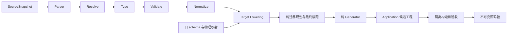

# 第三步：编译流水线、Lowered IR 与生成后端

日期：2026-09-08。状态：推荐设计草案。输入语义见[02](02-sir-language-and-modules.md)，数据库操作见[04](04-database-evolution.md)，交付格式见[05](05-source-package-and-docker-deployment.md)。

## 1. 推荐架构

**实现边界：**当前已具备单 SirSource -> AST -> Resolve/Type/Validate/Normalize -> SpringBootLoweredModel -> GeneratedFile -> 本地 Application 的编排；图构建使用编译结果。下面的 SourceSnapshot、多文件解析、旧 schema 输入、迁移规划、隔离构建与源码包发布是目标扩展。G0 验证既有链，G1/G2 扩展语义与身份，G3 增加迁移，G4 增加交付，G6 接入平台。[实现依据](implementation-baseline.md)

使用同进程内的分阶段编译和不可变快照，不将每个 Pass 做成网络服务。平台通过后台任务调用编译器，业务代码在独立构建环境中验证。这样可以分别证明输入语义、目标决策和生成产物，避免把判断逻辑藏在模板里。

Parser、Semantic、目标规划和 Generator 不主动探测环境。Application 独占工程文件与 Bundle/CURRENT 写入；平台构建/发布服务在外围执行依赖下载、构建进程、验收与打包。用户本地由部署入口操作 Docker，由随包 deployment-runner 核验/执行数据库迁移。后三类执行能力属于目标，不能因 Application 当前有文件事务就认为已经具备。

## 2. 阶段接口与失败模型

| 阶段 | 输入 | 输出 | 不得做的事 |
| --- | --- | --- | --- |
| Parser | 固定源字节和路径 | AST、SourceMap 或诊断 | Spring/MySQL 规则、读项目目录补引用 |
| Resolve | AST 与确定模块集合 | 唯一 SymbolTable、ReferenceBindings | 静默覆盖同名/同 ID 声明 |
| Type | AST、binding、symbols | 类型快照 | 按名称再次查询语义 |
| Validate | 已绑定、已类型化快照 | ValidatedSnapshot | 重复报告符号存在性错误 |
| Normalize | ValidatedSnapshot | NormalizedSemanticModel | 改 AST、修复非法输入、生成 unknown 身份 |
| Lowering | Normalized + Profile + 旧物理映射 | 候选 SpringBootLoweredModel | 访问真实数据库、模板内临时补决策 |
| Migration planning | 旧/新 Lowered schema + intent + 历史 | MigrationDefinition 或安全诊断 | 根据名称近似猜测重命名 |
| Finalize Lowering | 候选模型 + MigrationDefinition | 完整 SpringBootLoweredModel | 让文件、SQL、DTO 契约互相矛盾 |
| Generator | 完整 SpringBootLoweredModel | GeneratedFile 集合 | 读 SIR/AST/Normalized/SymbolTable，写磁盘 |
| Application 文件应用 | 文件集与文件基线 | 工程文件、Bundle/CURRENT | 在 CLI/网页旁路直接操作事务状态 |
| 构建/发布服务（目标） | 候选工程与固定 Profile | 验收证据、源码包及 Release | 将文件已提交等同于数据库已部署 |

各阶段返回 Success 或 Failure，Failure 携带结构化诊断；普通非法输入不以运行时异常逃逸。资源上限超出返回明确的 INPUT_LIMIT，模板缺失或编译器 bug 作为 INTERNAL 编译失败，不归咎于用户语法。

## 3. NormalizedSemanticModel

以下是目标模型应承载的语义，不是当前字段清单。当前模型按既有声明、capability/workflow、类型与 binding 表达；PATCH 三态、根分页、完整授权与模块组合要随能力切片补齐。

Normalized model 保存目标无关的实体身份、类型、关系、操作、query、约束、授权和流程。所有引用以 SymbolId + role 表达，不再保留必须重新查找的裸名称。

默认值、查询条件省略、PATCH 三态和流程步骤在此阶段已经显式化。关联实体与有限步骤已经标准化，排序和集合遍历确定；SourceMap 独立保留当前源定位，不把行号作为业务身份。

Core 中的事务表示某业务操作需原子完成及其冲突规则，不携带 @Transactional 注解字符串。数据库约束表达唯一性、关系完整性和精度，不直接携带 MySQL ALTER SQL。

## 4. Target Profile 与能力选择

推荐课程 Profile：Java 21、Spring Boot 3.5 系列、MyBatis-Plus 3.5 系列、MySQL/InnoDB、同步 REST、Maven、单实例会话认证。精确 patch 版本、镜像摘要、JDK 分发和 CPU 架构组成一个验证过的 Profile 发行，不在本设计中冒称已通过验证。

Profile 包含类型映射、SQL 方言、依赖和插件锁定、模板版本、默认 HTTP 规则、字符/时间策略、构建配方、部署协议及能力列表。新增能力必须声明可支持组合，不只列出单项名称。

首轮不通过用户 SIR 自定义仓库地址、Maven 插件或 Dockerfile。依赖来自受控能力映射；DependencyPlanner 是 Lowering 的纯子步骤，确定完整构建声明。实际下载在执行阶段完成。

## 5. Lowered 子模型

本表是目标职责划分，不声明同名 Java 类已经存在，也不要求机械拆成八个模块。当前 SpringBootLoweredModel 包含 irVersion、profile、softwareName、displayName、basePackage、declarations、artifacts、mavenProject、applicationMain；没有本设计的完整 MigrationModel/DeliveryModel。保持独立 Lowered 边界，通过版本化模型演进补齐目标决策。

| 子模型 | 包含的决策 |
| --- | --- |
| ProjectModel | Maven 模块、包名、所有输出路径、依赖/插件、模板版本 |
| DataModel | Java 类型、表列、主键、version、索引、外键、约束及来源身份 |
| ApiModel | 路由、方法、DTO、PATCH presence 表示、序列化和错误映射 |
| QueryModel | SQL 结构、参数绑定、投影、根分页、count 与批量关联方案 |
| ServiceModel | 事务入口、操作步骤、锁顺序、条件写入、失败转换 |
| SecurityModel | 会话、CSRF、认证映射、角色/数据范围、字段权限 |
| MigrationModel | 旧历史文件、新增类型化迁移及前后检查声明 |
| DeliveryModel | Docker/Compose、入口脚本、执行器源码模板、版本清单渲染输入 |

每个子模型可独立验证；最后做跨模型一致性校验。例如 Create DTO 的必填字段必须能供持久化满足约束，API 可写字段不能包含 serverManaged，路由不能碰撞，生成 query 参数必须与 SQL 参数一一对应。

Target 名称在 Lowering 统一分配并存表；Java 类名、JSON 名、SQL 列名和显示 label 分开。旧物理映射以 SymbolId 继承。Java 保留字和文件大小写冲突在生成前诊断，不通过平台相关的随机后缀解决。

## 6. 生成工程的内部组织

生成包使用 Maven 根工程，app 与 deployment-runner 两个子模块。app 按业务包组织 Controller、Service、Mapper、Entity 与 DTO，共享包提供错误、认证和必要基础设施。小业务不强制生成只有一行转发的额外 Repository 接口。

Controller 负责请求绑定、调用已定义服务与响应；Service 负责业务规则和事务；Mapper 负责已规划的参数化访问；Entity 只作持久化映射；DTO 显式控制读写边界。Controller 不拼 SQL，Mapper 不偷偷决定业务权限。

当前 GeneratedFile 字段为 relativePath、content、artifactId、可选 symbolId。目标交付还需要 kind、fileMode 等元数据，应在 G4 明确由版本化文件对象或交付封装承载，不把它们描述为现有字段。输出路径唯一、规范且顺序确定；文本统一 UTF-8/LF，运行时凭据不写入生成内容。旧迁移字节由冻结输入提供，Generator 不重新格式化它们。

## 7. PATCH 与并发更新实现契约

请求解码必须保留 changes 的字段存在性。不要依靠普通 nullable POJO 判断用户是否想清空，也不能让序列化框架默认忽略未知字段。

服务在授权范围内读取实体，组合候选值，执行完整约束，使用 id + version 的 SQL 条件写入并递增 version。更新结果必须检查影响行数；冲突返回 409。删除、状态动作也按声明采用版本或锁机制，不产生失控覆盖。

字符串长度语义是码点数，Java 校验器必须与此一致，不能直接把 UTF-16 字符单元长度误当业务长度。Decimal 使用精确类型并验证 scale/precision；SQL 转换警告不当作可接受的静默截断。

## 8. 查询的具体生成策略

普通单表 query 生成参数化 SQL 或等价受控 MyBatis-Plus 调用，动态排序只映射到已声明的固定列。调用者传来的列名不能拼进 SQL。

有一对多过滤时，根分页 query 使用 EXISTS 或去重根 ID 的明确方案。推荐先 count 授权/过滤后的根集合，再读取当前页根记录，对被请求的关系按根 ID 批量读取。保持同一只读 REPEATABLE READ 事务中的一致快照，不混入会改变读语义的锁定读。MySQL 的一致性读行为需以锁定版本验证。[MySQL 隔离级别](https://dev.mysql.com/doc/refman/8.4/en/innodb-transaction-isolation-levels.html)

一个 query 的 SQL 次数预算在 Lowered 中明确：基础 count + page 两次，每种必要关联最多增加一次批量查询；空页跳过关联读取。首轮投影深度和数量有界，不能因 20 条记录执行 20 次同形补查。

items 的顺序以根排序为准；关联集合各自有确定排序。总数按根实体计算；分页越界为空页，不是 404。关联不足或无权限时采用 query 声明的可空/过滤规则，不用空对象掩盖损坏外键。

## 9. 报名与取消的事务方案

推荐课程版统一锁顺序：先 Course，再指定 Student/Course 的 Enrollment。对同一课程的报名动作串行进入名额判断，降低课程规模场景的正确性验证难度；这会限制单课程并发吞吐，首轮接受此代价。

报名执行：

1. 在服务事务内核验当前身份与操作权限，取得课程行的更新锁。
2. 读取该学生该课程的 Enrollment 当前记录并核验状态；ACTIVE 则 409。
3. 核验 enrolledCount < capacity，并以同样边界条件递增计数，检查影响行数。
4. 没有记录则创建 ACTIVE；已有 CANCELLED 则重新激活并更新 version。
5. 提交后返回投影；任何唯一冲突、边界失败或异常都回滚计数与报名变更。

取消入口以 courseId 和当前 Student 定位，沿用 Course -> Enrollment 锁顺序；ACTIVE 转 CANCELLED 后递减 enrolledCount，边界不成立则失败回滚。重复取消为 409，不重复递减。capacity 的管理员修改也遵守课程锁与新容量 >= enrolledCount 约束。

禁止用通用 CRUD 直接写 enrolledCount 或流程状态。数据库仍设置组合唯一性与必要边界约束作为最后防线。死锁或锁超时给出明确可重试冲突，首轮不隐式重试整个非幂等 HTTP 请求。

Spring 默认回滚规则并不覆盖所有 checked exception；生成事务入口应显式固定所需回滚类型，并避免捕获异常后返回成功对象导致提交。[Spring 事务回滚](https://docs.spring.io/spring-framework/reference/data-access/transaction/declarative/rolling-back.html) 业务 HTTP 错误在事务已回滚后由外层统一映射。测试必须从实际代理入口调用，不能以绕过代理的单元测试证明事务有效。

## 10. 认证与前端对接

生成后端提供登录、退出、当前身份和 CSRF 令牌获取入口；首轮使用内存会话，重启后重新登录。密码散列采用 Profile 中验证过的 Spring Security 编码方案，不在业务模块自行实现密码算法。

浏览器 Cookie 认证启用 CSRF。文档和请求示例需包含取得令牌、携带 Cookie 与提交令牌的完整调用流程；不能为了让 Swagger 或前端容易调用而全局关闭保护。[Spring Security CSRF](https://docs.spring.io/spring-security/reference/servlet/exploits/csrf.html)

默认课程环境只绑定本机回环地址，HTTP 本地开发与 HTTPS 公网配置分别明确。跨域 origin 通过本地配置白名单提供，携带凭据时不使用任意 origin。普通用户一键部署不要求理解这些内部配置，前端对接说明提供可直接采用的本地默认值。

错误输出与 02 一致，时间点 UTC、主键/精确小数字符串化，空集合为 []。OpenAPI 从 ApiModel 产生，不能读取 Controller 注解后再猜另一套接口契约。

## 11. Generator 与平台 Application 的连接

目标链由 Application 在独立候选目录应用 GeneratedFile 并执行路径与归属检查；外围构建/发布服务运行 Maven 构建和隔离 MySQL 验收，再导出不可变包。当前 Application 文件提交不包含完整的这些外围能力。生成器不接触 CURRENT、LOCK 或 Journal；最终文件摘要和 ZIP 摘要由导出服务在实际产物形成后计算。

Project Symbol Graph 只消费正式身份关系供 context/影响说明使用，不重新解析名称、不访问文件系统；本路线不需要 REFERENCES 扩展来保证正确性。

所有平台执行输入固定到 SourceSnapshot 和父版本，用户在生成期间继续编辑只产生新草稿。候选失败不会破坏既有发布。包发布与版本竞争由 06 定义。

## 12. 本步测试与完成门

| 证明目标 | 必要测试 |
| --- | --- |
| 阶段职责明确 | 各类非法 SIR 只在所属阶段报错，绑定只解析一次 |
| 目标模型自洽 | 缺路由/缺参数/重复路径/不支持类型在 Generator 前拒绝 |
| 生成确定 | 同冻结输入重复生成、不同 Locale 和路径环境生成，字节一致 |
| 生成工程可用 | 完整 Maven 构建；请求、持久化和 API 文档一致 |
| PATCH 不丢值 | 缺席/null/值、不可写字段、并发版本冲突、完整对象校验 |
| 查询正确 | JOIN 不重复根、分页 total 正确、SQL 次数预算满足 |
| 事务正确 | 真实 MySQL 并发报名、取消、名额边界及提交失败回滚 |
| 鉴权正确 | 匿名、错误角色、其他学生记录、受控字段均被正确拒绝 |

每个新增 SIR 能力同时有 Normalized 表达、Lowering 决策、生成产物和独立业务场景。测试输出可以来自生成模板，但关键断言和数据期望必须由独立场景定义，避免自证。
