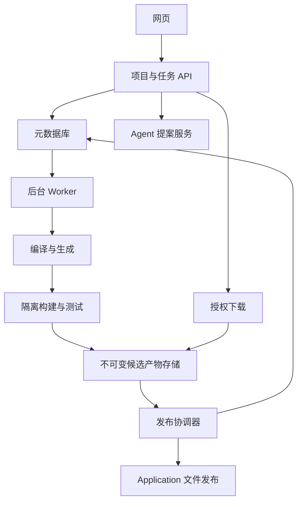

# 第六步：网页平台、生成任务、发布与缓存

日期：2026-09-08。状态：推荐设计草案。消费[产品契约](01-product-and-delivery.md)、[编译接口](03-compiler-and-generated-backend.md)与[交付格式](05-source-package-and-docker-deployment.md)。

本设计支持网页生成并下载源码，不建设用户业务托管平台。平台拥有自己的账号和项目权限；生成后端的 Account、数据和本地环境完全独立。

**实现边界：**本章 Web API、草稿/任务数据库、Worker 租约、发布协调器、Release 下载和平台缓存均是目标设计，尚未在当前生产链实现。本地 Application/Bundle/CURRENT 可作为内部文件应用基础，不能等同于已存在的平台服务。G6 在 G4 源码包与 G5 课程业务验证后实现 WEB/JOB/PUB 及所启用缓存的 CACHE 场景；跨项目语义缓存与模块市场保留为后续规划。[实现依据](implementation-baseline.md)

## 1. 最小平台结构

推荐模块化 Web API、后台 Worker、单独发布协调器、关系型元数据库和产物存储。首轮可部署在一个受控主机或一组明确分工的进程上，不为每个编译 Pass 建立微服务。

首轮元数据库推荐 MySQL，复用团队已有数据库技术范围，实例与用户业务数据库隔离。任务队列先使用数据库持久记录与租约，避免额外引入消息系统；负载证明需要时再替换队列适配器。产物可先使用受控本地不可变文件存储，接口支持后续对象存储。

后台构建放在受限隔离环境，输入只来自受控 SIR、Profile 和模块包，不允许网页上传任意 pom.xml、构建脚本或 Dockerfile 后直接执行。

## 2. 核心存储实体

| 实体 | 关键字段 | 不变量 |
| --- | --- | --- |
| Project | projectId、ownerId、headReleaseId、activePublicationId | 权限检查先于内容读取；主线发布单一 |
| Draft | projectId、draftRevision、文件内容、更新时间 | 保存采用 expectedDraftRevision，禁止旧写覆盖 |
| SourceSnapshot | sourceSnapshotId、projectId、源文件清单、模块锁、Profile | 发布后不可变 |
| GenerationJob | jobId、snapshotId、candidateReleaseId、expectedParent、status、stage、attempt、leaseToken | 一次提交固定输入；只有有效租约可提交候选 |
| JobEvent | jobId、递增 sequence、stage、message、时间 | 可重连读取，不含凭据和用户数据库行 |
| Artifact | 内容摘要、大小、存储键、状态、归属 | 写入完成并核验后才可被 Release 引用 |
| PublicationIntent | projectId、目标 releaseId、前后 Bundle、候选摘要、阶段 | 同项目最多一个未决发布 |
| Release | projectId、releaseId、parentReleaseId、manifestDigest、包摘要、证据引用 | 发布后只读，不回写迁移 |

SourceSnapshot、构建缓存与平台 Release 不保存用户本地 environmentId 或数据库密码。发布记录可以保存 schema 契约，不把它当用户已经迁移的证明。

## 3. 网页 API 建议

以下是建议的资源接口，不代表当前 CLI 或 HTTP API 已存在。

| 请求 | 输入/结果 | 关键检查 |
| --- | --- | --- |
| POST /projects | 名称和模板 -> projectId | 所有者身份、配额 |
| GET /projects/{id}/draft | 草稿与 draftRevision | 项目可读权限 |
| PUT /projects/{id}/draft | expectedDraftRevision、文件集 -> 新修订号 | 版本比较，不接受受保护路径或任意生成文件 |
| POST /projects/{id}/proposals | 需求、基于哪个草稿 -> SIR 修改提案 | 提案不自动覆盖后来编辑；模型只返回受限变更 |
| POST /projects/{id}/checks | 指定草稿修订 -> 编译/变更预览 | 固定快照；无真实数据库访问 |
| POST /projects/{id}/jobs | snapshotId、expectedParent、幂等键 -> 202 + jobId | 快照、模块与 Profile 权限和限额 |
| GET /jobs/{id} | 状态、阶段与诊断引用 | 对 job 所属项目鉴权 |
| GET /jobs/{id}/events?after= | 递增事件流 | 支持断线重连与去重 |
| POST /jobs/{id}/cancel | 取消请求 -> 当前状态 | 发布提交边界后的取消语义明确 |
| GET /projects/{id}/releases | 已发布版本及所需父版本 | 可见性过滤 |
| GET /projects/{id}/releases/{release}/download | 指定不可变包 | 再次鉴权，校验产物存在且已发布 |

同一幂等键且请求摘要相同返回同一 job；相同键不同输入返回 409。不同用户或项目的幂等键不共享命名空间。快照体积、文件数、模块数、操作数和构建预算有明确配置上限。

创建生成 job 的元数据库事务同时预留 candidateReleaseId，此值从编译生成到打包发布保持不变，并作为完整生成输入。重试同一 job 不换号；失败任务可以留下编号空缺。parentReleaseId 由请求冻结，不能用序号减一来推断父版本。

下载可以使用 API 流式返回或短期授权链接，但存储键本身不构成访问权。过期下载入口可以重新签发，不改变 Release 内容。

## 4. Agent 与用户编辑的协作

Agent 提案绑定 expectedDraftRevision、需求快照和允许修改范围。它可以创建/修改 SIR、补稳定身份、解释诊断；不能上传任意 Java 作为“修复”。实际保存前执行语法和结构检查，并做草稿版本比较。

用户在提案生成期间编辑，旧提案应显示冲突或重新基于新草稿生成，不静默合并。自动诊断修订使用有限循环，首轮推荐最多三轮；超限返回当前诊断和失败原因，用户可以继续手动编辑或另发请求。

Release 生成任务只接收已冻结 SIR，不在构建失败后悄悄让模型改源码。编译器 bug 或依赖环境故障由平台报告；修复工具链后基于同一源另起任务，保留失败证据。

## 5. 后台任务与租约

jobStatus 和 stage 使用共享契约定义。Worker 原子领取 QUEUED 任务，递增 attemptNumber 并取得新的 leaseToken。长阶段通过租约心跳表明仍在运行；租约过期可以重新排队，但旧 Worker 的结果不能再更新任务或提交候选。

每次写状态、上传完成确认和提交候选都附带当前 leaseToken 做比较更新。产物存储路径包含 jobId/attempt，避免旧 Worker 与重试 Worker 写同一个可变目录。

任务重试只复用相同不可变输入，失败类型决定是否自动重试：暂时性下载/构建基础设施失败可有界重试；SIR 诊断、版本冲突或确定性测试失败不自动反复跑。实际重试次数和总耗时记入任务事件。

取消在发布准备之前停止后续阶段并终止本次隔离进程；保留必要诊断。发布已进入持久化提交协议后不能随意中断 CURRENT 事务，界面显示正在完成提交；最终以真实发布结果为准，不同时返回 CANCELLED 与已可下载的成功包。

## 6. 隔离构建与验证

每个 attempt 使用独立工作目录、数据库和容器资源命名，限制 CPU、内存、时间、磁盘和输出量。数据 fixture 只来自平台验证案例；不接触用户本地数据库。

网络访问限定为固定依赖来源与必要平台内部端点，构建中不注入平台账号密钥或存储管理凭据。Worker 与构建进程的权限分开；面向不可信输入的构建服务不直接暴露宿主 Docker socket。

任务工作目录的清理必须核验路径/归属。取消和失败后按本次 attempt 删除可重建临时资源，不用全局 docker prune 或共享目录递归清理。平台状态和公开缓存不与临时目录混放。

平台验证包括源码构建、迁移到隔离数据库、业务场景和独立部署包检查。通过不意味着用户机器已通过；平台验收证据明确记录 Profile、测试版本和运行环境。

## 7. 不可变发布协议

源码包、平台元数据库记录与工具链文件 CURRENT 不能假设共享一个原子事务。此处元数据库是平台任务/Release 数据库，不是用户业务数据库。推荐使用单一发布协调器处理每个项目的发布；普通 Worker 只提交不可变候选，没有写 CURRENT 的权限。协调器通过 Application 写工程文件，不能直接接管其事务状态。

发布步骤：

1. 核验有效 Worker 候选、完整平台验收和输入摘要。
2. 对 projectId 比较 headReleaseId 与 expectedParent，持久化 PublicationIntent，使用任务已预留的 candidateReleaseId 并占用 activePublicationId。
3. 同一项目有未决意图时先恢复它，不开始第二次发布。项目草稿编辑仍可继续。
4. 通过 Application 完成候选工程文件事务及 B0 -> B1 的 CURRENT 发布；写入意图阶段 FILES_PUBLISHED。
5. 固定 releaseId 的源码包和 Manifest 全部写入不可变存储，校验文件与 ZIP 摘要。
6. 元数据库事务发布 Release，推进 headReleaseId，标记 job SUCCEEDED 并清除发布占用，使下载可见。

候选在准备时发现 head 已变化，返回 JOB.HEAD_MOVED，不重基、不覆盖，也不自动以新父版本复用旧迁移。

恢复 PublicationIntent 时读取持久证据：CURRENT=B0 按既有方向向后补偿；CURRENT=B1 只向前核验与完成发布；其他或证据不足时阻断该项目发布并保留现场。不能因 job 租约到期而回滚已提交文件。已提交 Release 但 job 结果丢失时，以同一 releaseId 幂等完成状态，不能再发一个包。

首轮发布协调器只在受控单主执行环境运行，底层文件锁与持久意图共同串行化；多主/多区域发布是未来扩展，不靠数据库租约假装已解决文件写入者隔离。

## 8. 存储生命周期

草稿可以修改，SourceSnapshot/Release/Manifest/迁移不可变。产物按内容寻址或不可变版本路径写入，先完成临时写并校验，再发布引用；下载不能读取半成品。

保留所有仍被发布主线引用的迁移和支持基线版本。首轮相邻升级要求中间包可下载，不能清理旧包后仍承诺 r0001 可升级到 r0003。大文件和失败候选可按策略回收，但发布引用的源码不可因缓存淘汰而消失。

平台删除用户项目与用户本地运行无联动。本地已下载包不依赖平台心跳；默认不远程停止用户应用或删除其卷。

## 9. 缓存分层

Docker 可以缓存未变化的构建输入和包下载；依赖层应位于高频变化业务源码之前。[Docker 构建缓存](https://docs.docker.com/build/cache/optimize/) SIR 语义缓存需要额外的依赖与身份契约，不能把两者视为同一个 hash。

| 缓存 | 精确键应包括 | 首轮安排 |
| --- | --- | --- |
| 公共 Maven 构件 | 来源策略、坐标、实际字节摘要 | 实现；下载内容验证，不允许用户覆盖共享条目 |
| 基础构建环境 | 镜像摘要、平台架构、固定工具版本 | 实现；不包含用户密钥 |
| 编译阶段 | 源/模块内容、编译器版本、规则包、身份/绑定、当前源映射 | 先完整编译，测量后再优化 |
| Lowering / 生成 | 完整阶段输入、Profile、旧物理映射/历史、生成器和模板版本 | 可在测量后做项目内精确复用 |
| 包构建 | 生成文件全部摘要、依赖解析、工具链、参数和平台 | 使用 BuildKit/Maven 已验证缓存；不只 hash pom.xml |
| 验收结果 | 实际产物、Profile/环境、测试与 fixture 版本 | 首轮正常执行；未来精确复用时标注证据复用与原时间 |

任何缓存未命中或损坏都回退正常计算；不能生成一个“近似命中”工程。内容相同不等于用户有权查看，鉴权不参与被绕过的缓存流程。

## 10. 名称变化与失效传播

纯显示名变化可能只影响文档和配置；API 字段名变化影响序列化和接口；Java 包名变化影响文件、引用和编译；物理表列名变化触发数据库策略。分别按实际消费者失效，不能移除所有名称后复用整个包。

项目内的稳定 SymbolId 能帮助定位影响，但缓存中的 SourceSpan 必须映射到本次源；结构相同但来源不同的缓存诊断不能直接返回旧行号。

未来模块缓存优先复用同一 moduleDefinitionId/version 的未实例化定义，再按本次实例身份绑定和渲染。跨项目“所有结构同构”的自动识别不进入首轮。受控公共模块可跨项目共享，用户私有 SIR、产物与日志按项目隔离。

## 11. 最少需要的可观测性

每个任务记录阶段耗时、输入/产物摘要、工具与 Profile 版本、attempt、命中缓存类别、失败阶段和错误码。区分 Agent 修订时间、编译生成时间、依赖下载时间、构建测试时间，才知道优化应落在哪里。

网页提供阶段进度与诊断摘要，详细日志按权限查看并限制体积；不显示完整环境变量或默认上传用户业务数据。缓存复用的报告标明来源任务和验证时间，不包装成当次重新运行的证据。

## 12. 本步完成门

并发保存草稿不丢修改；Agent 旧提案不能覆盖新草稿；重复幂等请求只产生一个有效 job；Worker 过期后不能更新状态；两个候选竞争父版本只允许一个发布；每个发布中断点可按 CURRENT 证据恢复。

下载只有在包完整且 Release 已提交后可见。关闭平台后已下载包仍能本地运行。缓存启用/关闭的确定性输出一致，项目私有内容不能通过命中另一个项目的缓存被读取。

首轮负载验收使用固定小批量课程任务并记录队列与各阶段耗时，不宣称未经测量的高并发能力。容量不足先调整 Worker 数量与任务预算，再决定是否需要消息队列、共享远程缓存或多机发布协议。
