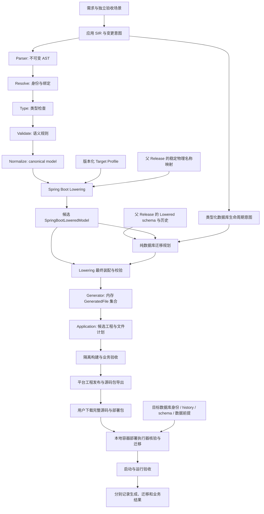

# KCG-Code 基础框架设计：以完成课程任务为验证主线

日期：2026-09-08

状态：设计草案，供讨论；不是实现报告、Accepted ADR 或已发布能力清单。

文档定位：历史框架总览。后续目标设计以同目录下的[主设计文档](README.md)为主，阶段推进以 [`../roadmap/README.md`](../roadmap/README.md) 为主；本文保留用于背景追溯。

本文与主设计文档均为目标设计。2026-09-08 已按源码与当次可执行测试校准边界：当前实现为“单文件 SIR 编译器 + Spring Boot 代码生成器 + 本地文件事务”，不代表完整课程产品已经实现。详细的已实现、部分实现、尚未实现及后续规划见[实现证据对照](implementation-baseline.md)。目标保持不变；实施前与 Accepted ADR 对齐并另立工作单，不因本草案直接重构项目。

阅读约定：除明确标注当前实现的段落外，以下“应当/必须/提供/生成”等均为目标要求。多文件 SourceSnapshot、持久 declarationId、完整查询/授权、数据库迁移、源码包、Docker 和 Web 平台不能从现有编译器能力直接推定。实施阶段统一使用 G0–G7，文档 00–07 是阅读顺序，均不替代仓库活动工作单。

配套的[详细设计文档集](README.md)进一步定义产品交付、SIR、编译生成、数据库演进、Docker 部署、网页平台与验证路线，并提供独立的共享契约。该文档集同样属于推荐设计，不是实现或资格报告。

## 1. 产品目标与验证范围

**让学生通过需求描述、生成 SIR 和持续修改 SIR，得到能够运行、对接和完成课程任务的 Spring Boot 后端。**

用户通过网页完成需求表达、SIR 编辑和版本生成，下载完整源码交付包后，在本地只需已安装并运行的 Docker（含 Compose）和系统自带的脚本入口即可一键部署。用户不安装 KCG-Code、JDK、Maven 或 MySQL。KCG-Code 编译与生成在平台侧完成；本地包能独立构建、迁移和运行，不依赖平台在线或平台账号续期。

用户可以直接编辑 SIR，也可以让 Coding Agent 修改 SIR。Java、SQL、配置、接口文档和工程文件是工具链的派生产物，不作为日常需求编辑入口。修改生成源码不能成为修复生成质量问题的常规路径。

首轮选择单体、单数据库、同步 REST 的管理类应用；完整验证范围包含 CRUD、组合查询、分页、参数校验、实体关联、角色权限和简单业务流程。覆盖课程、图书、活动、商品等相似业务形态，不承诺任意 Spring Boot 工程都能表达。

交付成功必须同时满足：

1. 从网页下载完整交付包，在仅准备 Docker/Compose 的声明环境中一键构建、初始化数据库并启动成功。
2. 正常和异常业务路径符合需求，有可复现的接口验收证据。
3. 用户能拿到接口说明、配置示例和启动步骤，完成前端对接。
4. 需求变化通过修改 SIR 实现，不需要人工修补生成源码。
5. 已有数据库执行受支持的结构更新后，既有记录和字段值得到保留。

首轮不展开微服务、分布式事务、支付、秒杀、任意 Java/SQL 嵌入、任意旧项目接管、Java 反向解析、通用流程引擎、自动前端生成或多数据库 Target。已有工程基础资格仍先按当前工作单收口。

## 2. 推荐框架与取舍

推荐采用**网页入口 + 平台侧模块化编译器与 Application 编排器 + 可独立部署的源码交付包**。生成的应用采用常规 Spring Boot 分层单体。网页 API 是薄入口，负责提交任务、显示诊断与提供下载；编译、生成、构建验收与导出由隔离的后台任务完成。

Application 管理工具链工程文件、Bundle 和 CURRENT；目标平台构建/发布服务在外围负责进程执行、验收和导出。下载包包含完整源码、容器配方、冻结迁移及最小部署执行器源码；本地入口操作 Docker，执行器在容器内核验并迁移数据库，不包含 SIR 编译器。这些外围执行边界是目标设计，实施前单独通过 ADR 明确，不能静默扩大当前 Application 的已实现职责。

| 方案 | 优点 | 主要成本 | 本项目选择 |
| --- | --- | --- | --- |
| SIR + 模板直接生成 | 初期路径短 | 语义、框架决策和模板逻辑容易混合，持续变更难验证 | 不采用为主框架 |
| 分阶段编译 + Lowered IR + 显式应用 | 可定位错误，可单独验证语义和生成结果，适合持续修改 SIR | 需要维护少量正式阶段契约 | 推荐 |
| 运行时解释 SIR 的通用平台 | 一套运行时承载多种应用 | 运行时、部署和扩展面明显扩大，交付不再是普通后端工程 | 首轮不采用 |

推荐技术组合：Java 21、Spring Boot、Spring Web、Bean Validation、Spring Security、MyBatis-Plus、MySQL/InnoDB、Maven、Flyway 和 OpenAPI。先保留项目已声明的 Spring Boot 3.5 / MyBatis-Plus 3.5 系列作为设计基线；本文不安排升级。实施阶段由一个版本化 Target Profile 锁定实际验证过的精确依赖版本、数据库版本和配置。

MyBatis-Plus 承担常规数据访问；复杂但受支持的关联查询由 Lowering 决定 SQL 结构，再确定性生成参数化 Mapper。SQL 不由 Agent 手写后塞入 SIR。Flyway 负责执行已确定的迁移脚本和记录历史，**不负责判断用户的业务意图，也不替代本项目的保留数据策略**。

编译阶段可以在同一进程内运行。阶段边界用于职责、类型和测试隔离，不意味着每个阶段都需要独立服务或独立 Maven 模块。先保留必要的深模块，避免把每一种 SIR 声明都做成一个子系统。

## 3. 用户操作闭环与 SIR 组成

```text
网页输入课程需求 / 编辑 SIR
  -> 平台 Agent 与编译器产生 SIR 和诊断
  -> 平台只读变更预览、生成与隔离验收
  -> 发布完整源码和部署文件的下载包
  -> 用户下载解压，一键 Docker 部署
  -> 随包执行器核验本地目标，初始化或更新数据库
  -> 启动应用并显示接口入口

后续需求 -> 网页修改 SIR -> 下载新版本 -> 本地执行更新入口
```

Agent 负责表达需求、保留稳定身份、解释诊断和提出修订。编译器负责合法性；Application 负责文件应用；平台构建/发布服务负责验收、导出和 Release 可见性；本地部署执行器负责核验实际数据库和执行冻结迁移。平台不需要访问用户本地数据库。不支持的能力必须返回可定位诊断，不能悄悄降级成空方法、无效接口或任意源码生成。

建议使用以下三类输入，避免将领域模型与执行环境混在一起：

| 输入 | 负责的内容 | 不包含的内容 |
| --- | --- | --- |
| 应用 SIR | 实体、字段、关系、操作、查询、校验、权限、流程与 API 契约 | 数据库密码、文件绝对路径、迁移执行记录 |
| Change / Lifecycle SIR | 稳定身份上的变更意图、数据库新建或更新意图、保留数据策略 | 一份重复维护的完整数据库模型、任意 SQL |
| Target Profile 与环境绑定 | Java/SQL 映射、依赖版本、数据库目标引用、运行配置引用 | 重新定义业务语义、把实际密钥写入 SIR |

这是概念划分，不要求首版必须创建三套互不相干的语法。实体的持久化含义、身份和约束来自同一份应用 SIR；MySQL 列类型、索引和迁移执行方式通过 Target 扩展与 Application 契约表达。

人可读名称与稳定 SymbolId 分离。新实体首次创建时分配并持久化稳定身份；后续修改保留它。不能根据行号或当前名称重新生成身份，也不能以名称相似度判断重命名。引用点的 AstNodeId、ReferenceRole 与 Resolve binding 继续承担跨阶段追踪职责。

上一段是 G2 目标。当前 SymbolId 编码软件名、种类及名称，AstNodeId 含 SourceId 与结构路径；现有确定性不能推导出改名/移动稳定性。版本化身份及旧格式显式映射按详细设计 02 验证，不静默重解释已有 Bundle。

下面用概念伪语法展示这些能力如何组合；字段名、关键字和文件拆分尚未冻结，不是当前可执行的 SIR 示例：

```text
entity Course @id("entity-course") {
  id: Id generated
  code: String(max=32) required unique @id("field-course-code")
  name: String(max=100) required @id("field-course-name")
  description: String(max=500) optional @id("field-course-description")
}

entity Enrollment @id("entity-enrollment") {
  id: Id generated
  student: Ref<Student> required onDelete(RESTRICT)
  course: Ref<Course> required onDelete(RESTRICT)
  status: EnrollmentStatus required default(ACTIVE)
  unique(student, course)
}

query SearchCourses(keyword?: String, page: Int=1, size: Int=20) {
  from Course
  when keyword.present: name containsLiteral keyword
  select [id, code, name]
  orderBy [code ASC, id ASC]
  pagination(page, size, maxSize=100)
}

operation CancelEnrollment(id: Id) {
  allow role(STUDENT) and owner(enrollment.student, currentPrincipal)
  transition Enrollment.status ACTIVE -> CANCELLED
  transaction required
}
```

其中 Student、EnrollmentStatus、Account 和身份映射由完整应用 SIR 另行声明。示例只说明组合方式；实际编译器必须拒绝未声明的引用。取消报名保留 Enrollment 记录；若允许再次报名，使用同一记录的显式重新激活动作，不能新增记录绕过组合唯一约束。

## 4. 课程后端需要的 SIR 能力

### 4.1 实体、字段和持久化

| 能力 | 首轮契约 |
| --- | --- |
| 基础类型 | 字符串、整数、长整数、定点小数、布尔、日期、时间点、枚举 |
| 空值 | 每个字段显式可空或必填；空字符串与 null 分别处理 |
| 字段约束 | 长度、范围、精度、格式、单字段与组合唯一性 |
| 主键 | 默认不可变技术主键；课程号、学号等业务编号单独声明唯一约束 |
| 默认值 | 明确作用于新建记录；修改默认值不代表回填旧数据 |
| 生命周期字段 | 创建时间、更新时间；需防止客户端覆盖服务端管理字段 |
| 并发版本 | 需要并发更新保护的实体声明 version，由生成器输出对应协议 |
| 字符与时间 | Profile 固定字符集、比较规则、时区与序列化规则，禁止依赖运行机器默认值 |

长整数主键在 JSON 中默认输出为字符串，减少 JavaScript 客户端精度问题；金额等精确小数按 Profile 固定表示与舍入规则。日期与时间点使用不同类型，不能统一塞进字符串后失去语义校验。

### 4.2 CRUD 与更新语义

实体声明不等于公开所有 CRUD 接口。每个操作必须明确输入、输出、权限和业务约束。

| 操作 | 默认行为 |
| --- | --- |
| 创建 | 专用 Create DTO；客户端只可提交声明可写的字段 |
| 详情 | 按主键查询；无记录返回 404；校验数据访问范围 |
| 局部更新 | PATCH；字段缺席表示保留，显式 null 表示清空且必须满足可空约束 |
| 删除 | 未声明则不生成删除入口；声明后必须明确物理删除或归档语义 |
| 并发更新 | 启用 version 时，携带预期版本并进行条件更新；冲突返回 409 |

PATCH 必须有“未提供 / 提供 null / 提供值”三态表达，不能只依靠普通 nullable Java 字段。把更新后的候选实体作为整体执行跨字段校验；不能只校验请求里出现的字段。

数据库结构更新中的“保留数据”不禁止用户通过有权限的业务接口明确删除一条记录。两者属于不同契约：迁移不能丢失旧数据，业务删除需要满足 SIR 已声明的操作规则。

首轮默认采用显式物理删除 + 外键 RESTRICT；有历史保留需求的选课记录采用状态变更或归档。归档不是偷偷开放级联删除，也不默认释放原有唯一业务编号。批量写入、嵌套保存和级联物理删除暂不纳入首轮。

### 4.3 查询、排序与分页

查询在 SIR 中声明参数和条件结构，调用者只能传参数，不能传 SQL、任意字段名或任意表达式。

| 能力 | 首轮契约 |
| --- | --- |
| 条件 | 等值、范围、集合包含、字符串包含、是否为空 |
| 组合 | 声明式 AND / OR 分组，不开放任意运行时查询语言 |
| 可选参数 | 参数缺席则省略指定条件；查询 null 使用独立的 isNull 语义 |
| 排序 | 白名单字段与 ASC / DESC；必须追加唯一主键作为同值排序的次级键 |
| 分页 | page 从 1 开始，size 默认 20、最大 100；非法值报错 |
| 返回 | items、page、size、total；空页 items 为空数组 |
| 投影 | 显式声明返回字段，列表与详情 DTO 可以不同 |

所有值参数绑定；字符串 contains 默认按字面量处理 `%` 和 `_`，不让用户输入改变查询结构。关联列表先对根实体分页，再按需读取关联数据，或生成等价的明确 SQL 计划，不能因为 JOIN 把同一根记录重复计数。

首轮使用 offset 分页。在同一静态数据集上保证排序稳定，不承诺并发增删过程中跨多次翻页的快照一致性；同一次请求的 items 与 total 推荐在同一只读事务快照中读取，由 Profile 固定相应隔离策略。游标分页、任意聚合报表和全文搜索后续按真实课程需求引入。

### 4.4 校验与错误反馈

校验分为三个时间点，防止把不同职责混成一个 Validator：

| 时间点 | 校验内容 | 失败结果 |
| --- | --- | --- |
| SIR 编译期 | 名称存在性、类型兼容、关系合法性、流程引用和契约完整性 | 阶段、错误码、SourceSpan、相关位置 |
| API 运行时 | 必填、格式、范围、状态前置条件、角色与数据归属 | HTTP 状态 + 稳定业务错误码 + 字段错误 |
| 数据库提交时 | 唯一性、外键、必要检查约束、并发条件 | 转换为明确业务冲突，不能把 SQL 异常原样返回 |

“先查询是否存在，再插入”不能独立承担唯一性保障；业务预检查用于给出清楚反馈，数据库约束仍是最后防线。HTTP 约定为 400 参数错误、401 未登录、403 无权限、404 资源不存在、409 状态或唯一性冲突；未预期故障使用 500 和可追踪标识。

首轮跨字段规则采用有限、可类型检查的表达式，例如开始日期不晚于结束日期。直接编译成目标代码，不引入通用 Constraint VM，也不允许运行任意脚本。

### 4.5 关联关系

首轮覆盖一对一、一对多、多对一；多对多统一使用显式关联实体。例如 Student 与 Course 通过 Enrollment 关联，Enrollment 可以拥有报名时间、状态和成绩。

每个关系声明目标身份、基数、可空性、持有外键的一侧和删除行为。一对一需要相应唯一约束；关联实体按业务声明组合唯一约束。首轮不做隐式级联写入。

返回 DTO 使用有限深度投影，例如报名列表返回学生姓名、课程名称和状态，不把双方完整实体无限嵌套。Lowering 负责决定 JOIN 或批量关联读取策略，避免逐行补查形成 N+1 查询。是否真正满足查询预算由集成测试确认。

### 4.6 权限、流程与事务

权限至少支持角色和当前用户数据归属，例如管理员维护课程，学生只查看及操作自己的报名。SIR 表达通用角色与授权规则；Spring Security 的接入方式由 Profile 决定。身份来自服务端认证上下文，不信任客户端传来的 userId 或 role。

首轮推荐单实例会话认证，覆盖登录、退出、密码散列、角色与数据范围校验；Cookie 会话的 CSRF 和跨域策略由已验证的安全配置统一生成。首轮不增加 OAuth 平台、多租户或分布式会话服务。

简单流程包含状态、动作、允许的来源状态、目标状态、角色和前置条件。例如报名由 ACTIVE 转为 CANCELLED，不能通过通用 PATCH 任意写状态。

一个业务操作映射为一个明确的数据库事务。涉及多行更新时，Lowering 选择已验证的锁或条件更新模式。比如名额限制必须使用事务中的条件扣减或等价方案，不能只靠“先读剩余名额再写回”。并发失败转为可理解的业务冲突。

MyBatis-Plus 提供乐观锁插件，但本框架仍需验证实际生成的更新方法是否带有版本条件、是否检查影响行数；不能以“已配置插件”替代业务并发测试。[官方说明](https://baomidou.com/en/plugins/optimistic-locker/)

## 5. 数据库 SIR：新建与更新必须分开

### 5.1 两种生命周期语义

应用 SIR 描述期望的数据模型；Lifecycle SIR 明确本次操作的意图。以下为概念伪语法，不代表当前 Parser 已支持：

```text
databaseLifecycle {
  target: "coursework-local"       // 环境引用，不是密码
  mode: INITIALIZE                 // 在明确指定的空 schema 中初始化
  dataPolicy: PRESERVE_EXISTING
}

databaseLifecycle {
  target: "coursework-local"
  mode: UPDATE
  expectedDatabaseBaseline: "db-v1"
  dataPolicy: PRESERVE_EXISTING
}
```

| 语义 | 前置条件 | 允许行为 | 必须阻断 |
| --- | --- | --- | --- |
| INITIALIZE | 指定 schema 为空且归属明确；连接和操作范围经过核验 | 创建业务表、约束、迁移历史与项目数据库身份记录 | 发现已有业务对象后清库重建，或自动接管未知库 |
| UPDATE | 已登记的项目数据库；基线、迁移历史及物理结构一致 | 生成并执行保留数据的增量迁移 | 缺少基线、历史被改写、结构漂移或潜在数据损失 |

默认交付包通过 Compose 创建全新隔离的 MySQL 实例，并在该实例中准备指定空 schema；用户无需手工安装 MySQL 或建库。连接已有或外部数据库是可选高级路径，需要明确的空 schema 或登记基线，不默认申请外部服务器级权限。

初始化的第一次应用绑定一个明确的操作身份；重复请求在身份、历史和后置条件一致时返回既有结果，不重新执行建表。环境准备不能将已有实例清空，也不能在 UPDATE 时重新创建环境来伪装成功。

同一个应用 SIR 可以用于全新环境初始化，也可以用于已登记环境更新。删除下载目录不会把 UPDATE 自动变回 INITIALIZE。平台声明允许的生命周期操作，本地随包执行器绑定实际目标并验证执行意图；Parser 和 Core Semantic 不连接数据库。

### 5.2 保留数据的精确定义

受支持的 UPDATE 必须保留原有行身份、数量和未被显式授权转换的字段值，不得使用清库、清表、丢列、删除旧记录、覆盖旧值或有损类型转换来达成目标结构。首轮只允许给新增字段填入声明的值，或对明确为空的字段做受控回填；任意旧值改写与数据清洗另立未来能力。

这是工具链对受支持操作的行为约束，不是对磁盘损坏、外部管理员误操作或任意环境的绝对零风险承诺。不满足前提或无法证明属于支持集合时，停止更新并给出原因。备份可作为环境恢复措施，但不能使破坏性 UPDATE 自动合法。

| SIR 变化 | UPDATE 处理 | 校验要求 |
| --- | --- | --- |
| 新增实体 | 新建表 | 名称不冲突，依赖顺序和权限有效 |
| 新增可空字段 | 新增列 | 不改写旧列，旧记录的新字段为 null |
| 新增必填字段 | 有明确回填策略才允许 | 先可空新增，再回填，再验证无 null，最后加约束 |
| 放宽可空限制 | 可允许 | 不改变已有值；更新 API 规则 |
| 扩大字符串长度或数值容量 | 仅允许 Profile 已验证的同类兼容扩展 | 检查精度、字符集、索引限制和转换行为 |
| 新增普通索引 | 可允许 | 评估锁等待与执行条件 |
| 新增唯一约束或外键 | 条件允许 | 检查重复或孤儿数据；发现问题不自动删数据修复 |
| 新增或修改默认值 | 只影响后续写入 | 不隐式覆盖历史记录 |
| 逻辑字段重命名 | 保留 SymbolId；首轮保留原物理列名 | API、代码名与数据库物理名分开管理 |
| 物理表列重命名 | 首轮不自动支持 | 后续通过显式映射和独立兼容性设计开放 |
| 删除实体或字段 | 阻断 | 不能将 SIR 缺失自动转换为 DROP |
| 缩小类型、减少精度、删除枚举值 | 首轮阻断 | 不能截断、替换或丢弃旧值 |
| 收紧已有字段约束 | 条件允许 | 旧数据扫描通过，执行时重新验证，数据库约束兜底 |

纯 API 或业务规则收紧可能保留数据库结构，却让旧记录无法按新规则更新。这类变更也要扫描受影响旧数据并报告兼容性影响；不得把“没有生成 DDL”当作无需检查。

### 5.3 迁移计划与历史

一次数据库更新比较的是**上次已登记的 Lowered schema 快照与本次 Lowered schema 快照**，同时使用稳定身份及显式变更意图。实际数据库内省只用于验证目标、结构漂移和执行前提，不用于按名称猜测领域语义。

目标父 Release 保存不可变的 Lowered schema、稳定身份到物理名称映射及迁移历史引用；编排层加载这些显式输入传给 Lowering，Lowering 不自行读盘。首次生成才按 Profile 分配物理名称，后续保留映射并检查冲突。当前文件 Bundle 不具备本章完整数据库契约；未来即使关联存储也不改变文件 CURRENT 的含义。

纯规划阶段先产生与具体环境无关的 MigrationDefinition，由最终 Lowering 纳入 SpringBootLoweredModel 后交给 Generator 渲染，并随导出包冻结；不增加 Generator 的第二输入入口。用户本地执行器将其与目标数据库身份、现场检查及脚本摘要组合为 DatabaseMigrationPlan。平台隔离测试不能替本地环境出具执行成功证明；现场证据不回流进 Generator。

DatabaseMigrationPlan 至少包含：目标数据库身份、旧数据库基线、目标结构指纹、Profile 版本、源与候选摘要、按顺序排列的类型化操作、前置检查、后置检查、保留数据分类，以及生成脚本的摘要。计划不能包含密钥或业务数据样本。

Flyway 按版本记录迁移及校验和，因此已发布的迁移应追加新版本，不回写旧文件。[Flyway 版本迁移说明](https://documentation.red-gate.com/fd/versioned-migrations-273973333.html) 本框架进一步规定：脚本纳入不可变 Release 后冻结；后续编译保留原文件字节，只追加新迁移。迁移编号由冻结历史确定，不用当前时间或随机数生成。文件 Bundle 的提交不能充当数据库 history 记录。

已有版本历史的项目在新空库初始化时，重放同一条冻结的迁移历史到目标版本；不能把当前模型重新生成一个内容不同的 V1。首轮不压缩或重写历史，也不接纳历史不一致的数据库。

数据库迁移历史、项目源码 Bundle 与运行验收记录分别维护。Flyway history 校验通过，不等于数据库没有被外部手工 ALTER；仍需比较管理范围内的实际结构。

只使用一种 schema 管理机制。推荐由随包的最小部署执行器在用户触发部署或更新时调用 Flyway；业务应用的普通启动流程关闭自动迁移和 schema.sql/data.sql 自动初始化。执行器复用经过验证的迁移检查契约，源码随包提供，不依赖本地 KCG-Code CLI。Spring Boot 官方也建议单一初始化机制，避免多种机制混用。[Spring Boot 3.5 数据库初始化](https://docs.spring.io/spring-boot/3.5/how-to/data-initialization.html)

### 5.4 执行、失败与恢复

推荐首轮采用本地停机更新：停止该项目的业务写入，获取项目和数据库迁移锁，重新核验计划前提，再按冻结计划执行。迁移锁只能协调工具参与者，不能阻止任意外部写入，因此首轮不承诺在线零停机迁移。

执行前重新检查数据库身份、结构、history、待执行脚本摘要、约束数据和必要的停写状态。预览后数据或结构变化可能使计划失效；不得把旧预览当作永久授权凭据。

MySQL 的 atomic DDL 不等于可组合的事务性 DDL；多条 DDL 不能依靠一个普通事务整体回滚。[MySQL 8.4 官方说明](https://dev.mysql.com/doc/refman/8.4/en/atomic-ddl.html) 因此采用以下设计：

1. 尽量把一次结构操作分为独立迁移单元，记录执行尝试与可核验的后置条件。
2. 全部完成并核验目标结构后，才登记新的数据库基线。
3. 部分成功时标记 DB_RECOVERY_REQUIRED，保留脚本、执行证据和数据库现场，阻断后续普通迁移及应用启动；状态名以共享契约为准。
4. 恢复必须显式触发；依据执行记录、Flyway history 与实际后置条件判定已完成步骤。证据不充分则停止。
5. 不自动执行 Flyway clean、任意 repair、回写校验和或重跑非幂等操作。首轮遇到需要修改失败 history 的情形，停在明确的恢复诊断；后续以单独 ADR 和故障测试引入受约束的前向恢复能力。
6. 不通过删除新增表列“回滚”数据库。恢复优先完成经验证的前向步骤，无法继续时保留状态供明确处理。

这允许首轮的恢复能力有明确边界：能够识别、阻断和说明部分迁移，但不声称所有失败都能自动修复。

演示数据单独作为开发环境 fixture 执行，使用专用测试库并保证重复加载的明确语义。UPDATE 和应用普通启动都不能自动重置学生已经录入的数据。

## 6. 从 SIR 到可用工程的推荐流水线

### 6.1 总体结构



数据库迁移规划是目标侧纯规划能力，由目标编排链调用，可放在 Spring Boot / MySQL Lowering 的配套模块，不加入目标无关 Semantic。类型化数据库生命周期意图不等于当前 sir-change 的工程文件变更计划。网页预览展示声明与候选 SQL，并显示“本地目标检查将在部署时执行”，不能因平台测试通过声称用户数据库可直接更新。

### 6.2 阶段契约

| 阶段 | 输入 -> 输出 | 唯一职责与边界 |
| --- | --- | --- |
| 解析 | UTF-8 SIR -> AST 或解析诊断 | 语法、SourceSpan、AstNodeId；不含 Spring/MySQL 语义 |
| Resolve | AST -> SymbolTable 与 typed bindings | 名称只解析一次，检查重复身份与引用；后续阶段不按文本重新找语义 |
| Type | 已绑定模型 -> 类型结果 | 类型推导、表达式与参数兼容；不重复做符号存在性判断 |
| Validate | 已绑定且类型明确的模型 -> 验证快照 | 关系、操作、查询、权限、流程与跨节点规则 |
| Normalize | 已验证快照 -> NormalizedSemanticModel | 目标无关、不可变、canonical；不修改 AST、不解析名称 |
| Lowering | Normalized model + Profile + 既有物理映射快照 -> 候选 SpringBootLoweredModel | 决定 DTO、实体、路由、安全配置、事务、SQL、schema、依赖与输出路径 |
| 迁移规划 | 旧/新 Lowered schema + typed intent + 历史 -> MigrationDefinition | 按稳定身份制定 INITIALIZE/UPDATE 操作与检查，不访问数据库、不写文件 |
| Lowering 最终装配 | 候选 Lowered model + MigrationDefinition -> 最终 SpringBootLoweredModel | 校验跨产物一致性；把迁移渲染决策纳入最终模型 |
| Generator | 最终 SpringBootLoweredModel -> 内存文件集合 | 仅渲染；不读 AST、Normalized model、SymbolTable、磁盘或数据库 |
| Application 计划与执行 | 文件集合 + Bundle + 工程快照 -> 文件计划、工程文件与下一 Bundle | 路径归属、新鲜度、冲突、文件锁、Journal、CURRENT 与恢复；不猜测数据库状态 |
| Verification runner（目标） | 候选工程 + 独立场景 -> 验收结果 | 外围构建服务在隔离目录与测试库执行，不污染真实业务库 |
| 构建/发布服务（目标） | 候选工程 + 验收证据 -> 完整源码包与 Release | 依赖获取、进程、清单、ZIP、发布可见性；通过 Application 写工程文件 |
| 本地部署执行 | 冻结部署声明 + 实际目标 -> DatabaseMigrationPlan 与本地收据 | 初始化、增量迁移、环境身份、数据库锁和部署恢复；不读写平台 Bundle/CURRENT |
| 网页 / CLI / Agent 接口 | 参数 -> typed Application request -> canonical 结果 | 不直接操作工具链工程状态、数据库、Bundle、CURRENT、LOCK 或 Journal |

所有公开集合保持不可变与确定顺序；标识和大小写处理固定 Locale.ROOT。相同 SIR、Profile、基线历史和工具链版本应输出相同文件字节。连接状态、执行时间和运行收据不参与 Generator 的确定性输入。

### 6.3 Lowered IR 应拥有的决策

最终 SpringBootLoweredModel 至少组织以下子模型，名称为建议而非现有 API：

| 子模型 | 已经决定的内容 |
| --- | --- |
| ProjectModel | 包名、依赖、启动类、配置占位与完整输出路径 |
| DeliveryModel | 构建与容器配方、环境声明、健康检查、Wrapper、部署入口及经验证的最小执行器源码渲染信息；不包含实际下载结果、主机状态或密钥 |
| DataModel | Java 类型、表列映射、主键、索引、外键、并发字段 |
| ApiModel | HTTP 路由、DTO、三态更新、状态码、序列化和 OpenAPI |
| QueryModel | 参数绑定、投影、查询结构、排序、分页与关联读取策略 |
| ServiceModel | 操作步骤、事务边界、错误映射、流程与并发控制 |
| SecurityModel | 认证集成、角色、数据范围和字段写入权限 |
| MigrationModel | 不可变历史、新增脚本的类型化操作、执行顺序与检查描述 |

模板不能临时决定某个字段是否唯一、是否需要事务或某种改表是否安全。不同 Lowered 子模型引用同一稳定身份；最终装配校验防止 DTO、SQL、数据库约束和接口说明各说各话。

Project Symbol Graph 可供变更影响说明与 Agent context 使用，但不承担数据库迁移的语义重建，也不访问文件系统。基础路线不依赖新增 REFERENCES 图扩展或图数据库。

## 7. 工程文件、数据库与运行状态的协调

平台代码文件事务、源码包发布与用户本地数据库迁移分别完成。推荐顺序为：平台隔离验收，发布源码包，用户下载后在容器中构建，部署执行器核验并迁移本地数据库，最后启动和验收。

| 独立状态 | 回答的问题 | 成功不能代替什么 |
| --- | --- | --- |
| 文件 Bundle / CURRENT | 当前本地工具链工程文件基线；目标平台可复用 | Release 可下载、用户已下载或数据库已经更新 |
| Release / ReleaseManifest（目标） | 不可变源码包属于哪个项目和版本 | 某个本地环境已经部署 |
| DeploymentReceipt（目标） | 某个 environmentId 的本地部署结果 | 平台自动知道本地部署结果 |
| Database baseline / history | 某个环境的数据库迁移到哪个版本 | 对应应用已构建、已启动 |
| Run / acceptance receipt | 哪个产物在什么环境通过哪些场景 | 其他环境也通过，或所有业务都正确 |

目标 ReleaseManifest 声明要求的数据库 schema 契约。首轮启动要求版本、迁移摘要和结构符合该契约；不满足时失败并提示执行数据库计划，不在启动时悄悄改表。该检查属于尚未实现的迁移/部署闭环，不是现有 Bundle 读取行为。

平台 CURRENT=B1 且包已可下载，只证明平台生成交付完成，不证明本地部署完成。用户本地源码包为新版而数据库仍为旧版是允许记录的中间状态；迁移失败时，不能显示本地部署成功，也不能以平台发布事实推断数据库恢复方向。平台不默认接收本地执行回传。

现有文件事务方向保持用户给出的 ADR-020 规则：CURRENT=B0 只允许向后补偿到 B0；CURRENT=B1 只允许向前验证和清理；其他情况失败关闭并保留证据。数据库迁移使用自己的历史和执行证据，不复用或改变 CURRENT 的含义。

工程文件应用仍需验证绝对根、包含关系、Windows 路径与大小写冲突、symlink/junction/reparse point、所有权及提交时的新鲜度。检测到用户直接改过生成文件时阻断覆盖并报告冲突，不能把偏差自动吸收为 SIR 语义。

网页展示“生成中 / 平台验收通过 / 可下载”，本地入口展示“构建中 / 数据库待更新 / 本地部署通过”等具体状态；分别定义成功，不能把平台测试结果伪装成本地运行结果。

## 8. 生成工程的交付形态

生成工程按业务包组织，每个业务包使用 Controller、Service、Mapper、Entity 和 DTO；公共包包含错误响应、安全配置和必要基础设施。避免把所有业务堆进一个 Service，也不为每个简单实体强制生成无用途的多层转发。

一个课程任务交付包至少包含：

- 完整 Maven 工程、确定版本的依赖与构建配置。
- Maven Wrapper、Dockerfile、Compose 配置、环境变量示例及独立部署/更新入口；封装方式见第 13 节。
- 随包的最小部署执行器完整源码、冻结的迁移检查声明与版本清单。
- 业务源码和带校验、权限、事务边界的接口。
- 按版本追加的数据库迁移文件；演示数据位于独立测试或开发目录。
- 环境配置模板；密码通过外部配置输入，不进入 SIR、生成包或日志。
- OpenAPI 文件、可执行请求示例和错误码说明。
- README：环境要求、配置、初始化、构建、启动、验证及常见失败处理。
- SIR 与生成产物的关联清单，以及生成、迁移、验收各自的版本摘要。

交付包必须能在没有 KCG-Code、宿主 JDK/Maven/MySQL 和平台登录态的机器上，通过 Docker 完成构建、初始化、更新及运行。部署执行器与业务源码均随包提供，构建依赖从声明的标准仓库或用户配置的镜像获取；不需要从平台拉取私有编译器才能启动。可选提供 Maven Wrapper 便于熟悉 Java 的用户本机开发，但这不属于普通用户前提。

## 9. 贯穿验证案例：学生选课后端

选择学生选课作为主线，因为它同时覆盖基础数据、关联、约束、权限、查询和事务，复杂度仍适合课程任务。该案例是建议验证样本，不把产品限定成选课系统。

核心模型：Account、Student、Course、Enrollment。Account 关联 Student；Enrollment 连接 Student 与 Course，保存状态和报名时间。角色为 ADMIN 与 STUDENT。

基础业务：管理员维护课程；学生查询课程、报名、取消报名和查询自己的记录；禁止重复报名、越权操作和无效状态跳转。名额限制作为后续简单事务能力的验证项加入。

| 验证轮次 | 需求与 SIR 变化 | 必须观察到的结果 |
| --- | --- | --- |
| 首次交付 | 网页创建实体、CRUD、角色和关系，下载完整源码包 | 仅有 Docker 的干净机器能一键构建、空库初始化并调用接口 |
| 查询交付 | 按课程名、状态过滤并分页；返回关联投影 | 结果、total、排序正确，无重复根记录 |
| 校验交付 | 学号唯一、字段必填、报名关系存在 | 明确错误码；冲突后无多余数据写入 |
| 流程交付 | 报名、取消、名额检查 | 非法跳转被拒绝；事务失败不留下部分业务变更 |
| 第二版变更 | 增加可空邮箱、扩大课程描述长度 | 旧学生、课程、报名记录与旧字段值全部保留 |
| 第三版变更 | 新增必填年级，并声明旧记录的回填值 | 先回填后约束；原有字段值不变 |
| 危险变更 | 删除成绩字段、缩小字符串、变更目标数据库 | 在执行前阻断；无真实结构或数据修改 |
| 异常恢复 | 注入迁移失败、运行中断、文件发布故障 | 状态可辨识，证据保留；不会清库或猜测恢复方向 |

数据保留验收使用固定数据集，覆盖中文、null、边界长度、精确小数和关联记录；在停写条件下逐主键比较迁移前后所有受保护字段与关联，不只比较行数。还需对照管理范围内的结构和迁移历史。

并发验收至少覆盖重复报名、名额争用和过期 version 更新。业务失败后的数据状态、影响行数和事务结果都要检查。

## 10. 后续阶段建议与完成门

以下 G 编号与[详细验收路线](07-validation-and-direction-roadmap.md)统一，不对应或替换仓库现有 Q 系列工作单。不设未经估算的工期，不并行展开所有能力。当前源码适合承接 G0，不能从有生成器直接跳到已完成网页产品。

| 阶段 | 交付重点 | 完成门 |
| --- | --- | --- |
| G0：现有链路资格收口 | 单文件编译、Lowered、Generator、PSG、Change 与本地文件事务 | 标准 clean 构建、生成样例、确定性及文件故障恢复；当前起点，尚不能宣布通过 |
| G1：单文件课程业务切片 | CRUD、查询分页、校验、关联与独立业务测试 | BIZ-01..06 基础场景、GEN-01/02；真实运行结果，不依赖 Web |
| G2：持久身份与受控模块 | 多文件、显式身份、旧格式映射与物理名称继承 | LANG-01..05 及身份兼容反例；不把当前名称编码 ID 当作改名稳定 ID |
| G3：数据库生命周期 | INITIALIZE/UPDATE、不可变迁移、漂移、数据保留与恢复 | DB-01..11；连续更新及逐字段保留，独立于文件事务 |
| G4：完整源码与 Docker 交付 | 源码包、执行器、依赖配方、脚本与持久卷 | GEN-03/04、DEP-01..08；仅准备 Docker 可独立部署 |
| G5：完整课程业务 | 登录、角色与归属、流程、并发与事务 | BIZ-01..13；完整选课业务，无人工源码补丁 |
| G6：网页平台与可靠发布 | 需求/SIR 编辑、任务、版本发布与下载 | WEB/JOB/PUB 与启用缓存的 CACHE；网页到本地部署闭环 |
| G7：独立试用与换题 | 学生试用、第二题、大创对比与方向评估 | 失败与人工介入均记录，以证据决定后续复用能力 |

G1–G4 未完成权限时仅用于隔离开发验收；G5 关闭完整业务门，G6 完成网页产品入口。调整子工作单顺序不能跳过身份、数据保留与独立部署的依赖门。

新增语义必须按完整路径交付：SIR 表达 -> 身份与绑定 -> 类型/校验 -> Normalized 表达 -> Lowering 决策 -> Generator 产物 -> Application 适用检查 -> 独立验收。不要先暴露语法，再留下空生成实现。

## 11. 验证体系与大创证据

测试分层是为了证明不同事实，不用测试总数代替交付质量：

| 层级 | 关键证据 |
| --- | --- |
| Parser / Semantic | 正反例、错误所属阶段、数量、SourceSpan、稳定绑定与身份 |
| Lowering / Generator | 同输入确定性、跨产物契约、参数化查询、迁移策略、完整生成工程可构建 |
| Application / 文件 | 平台工程新鲜度、冲突、发布与恢复方向、故障注入；保持现有工程安全边界 |
| 下载包 / 部署入口 | 仅有 Docker 的干净机器可独立构建运行；包完整、本地基线一致，断开平台后仍可运行和更新已下载包 |
| 数据库集成 | 使用 Profile 指定的真实 MySQL；初始化、连续更新、约束、漂移及部分失败 |
| 业务验收 | 独立编写的课程需求场景；响应正确性、持久化结果和权限/事务反例 |
| Agent 使用 | 从需求到 SIR、诊断修复、连续需求修改和换题过程的完整记录 |

数据库测试不能仅靠 H2 代替 MySQL 行为。平台隔离测试可使用容器或专用测试实例；学生默认交付路径必须验证 Docker/Compose，且测试机不得预装 KCG-Code、JDK、Maven 或 MySQL 来掩盖遗漏依赖。

工具可以生成基础测试，但关键验收由独立于 Generator 模板的需求场景定义，避免实现和测试重复同一个错误。对产品源码的人工修改不是正常成功路径：发生过就记录为失败或范围缺口，修复 SIR 表达或工具链后重新验证。

建议大创实验使用固定任务集，对比 Agent 直接开发与 Agent + KCG-Code；记录模型、版本、需求、工具条件和每次尝试，分别报告首次成功与修复后成功。指标包括业务用例通过率、到首次可运行的时间、人工介入次数、需求修改成功率、数据保留结果、危险操作拦截率和生成确定性。样本规模与重复次数实施前确定，不能用单次演示推断普遍优势。

商业化探索放在 G7 的真实试用之后：先观察学生能否理解诊断、完成第二轮修改、拿工程对接前端，再讨论收费和规模。本文不将商业可行性写成已得到证明的结论。

## 12. 需要在实施前冻结的决策

本文已经给出默认推荐，无需为了写草案中断讨论。实施前通过相应 ADR 或工作单固定以下具体契约：

| 决策 | 本文推荐 | 重新评估条件 |
| --- | --- | --- |
| 产品编辑入口 | 应用 SIR 与 typed Change / Lifecycle SIR，源码为派生物 | 出现必须支持外部手写扩展的真实需求 |
| 编译框架 | Resolve-once、目标无关 Normalized model、目标特定 Lowered IR、纯 Generator | 性能证据表明需要调整编排，仍保留职责边界 |
| 数据库更新 | INITIALIZE / UPDATE 分离；UPDATE 只允许保留数据的受支持操作 | 需要删除、拆表或复杂回填时，新增独立契约而非放宽默认策略 |
| 迁移执行 | 随包最小执行器核验冻结声明并调用 Flyway；源码随包；历史追加，业务启动只核验 | 需要在线迁移或外部托管数据库时再扩展执行契约 |
| 产品交付 | 网页生成并下载完整源码；本地只需 Docker/Compose，无 KCG-Code 安装 | 实际用户要求托管运行时，另立部署产品方向 |
| 故障协调 | 文件、数据库和运行验收分别记录，首轮停机更新 | 真实用户需要在线迁移或多实例部署 |
| 验证主线 | 学生选课后端，随后用另一类课程项目检验泛化 | 试用需求证明其他案例更能覆盖高频问题 |

后续实施应优先证明“一个课程任务能够首次生成、连续修改、保留数据并完成业务验收”，再依据缺口扩大 SIR 表达范围。

## 13. 依赖安装与运行环境封装

本节按 2026-09-08 用户最新确认修订：**网页生成，下载完整源码，本地只准备 Docker/Compose，一键部署。** KCG-Code 运行在平台侧，用户不安装它。JDK、Maven、MySQL 由容器准备。首轮只把 Docker 路径作为必须通过的交付契约，本机 Java 开发是附加用法。不自行实现容器引擎，也不把 Docker 指令加入业务 SIR。

### 13.1 分清哪些东西需要安装

| 类别 | 例子 | 推荐负责方与交付方式 |
| --- | --- | --- |
| 工具链本身 | KCG-Code 编译器、Generator 与 Application | 平台维护，用户机器不需要安装或下载工具链 |
| 主机前提 | 已运行的 Docker（含 Compose）、可用端口与资源 | 用户唯一的额外软件前提；交付包入口完成检查 |
| 构建工具 | JDK、Maven、构建插件 | 固定版本的容器构建阶段自动准备，宿主机无需配置 Java |
| Java 依赖 | Spring Boot、MyBatis-Plus、驱动等 | Profile 生成 POM，由构建容器中的 Maven 解析下载并缓存 |
| 外部服务 | MySQL | Compose 运行独立服务，数据放在专用持久卷；也允许绑定已有数据库 |
| 本地部署执行 | schema 检查、Flyway、部署收据 | 最小执行器源码随包，在容器中构建运行，不包含 SIR 编译器 |
| 项目配置 | 端口、数据库目标、凭据引用 | 随包入口提供本地默认值，首次部署创建并保存本地凭据，后续复用 |

Maven Wrapper 会按项目配置取得并复用指定 Maven 发行版；本设计主要在构建容器内使用它，用户不需要在宿主机配置 JDK。[Maven Wrapper 官方文档](https://maven.apache.org/tools/wrapper/)

用户体验是：网页生成 -> 下载 ZIP -> 解压 -> 双击部署入口或运行一个脚本 -> 打开显示的接口地址。首次部署默认创建隔离数据库并生成本地连接凭据，不要求学生先编辑 application.yml、安装 Java 或手工建库。端口冲突等必要选择由入口集中反馈。

首轮仍需联网拉取公共基础镜像和 Maven 依赖，但下载后的包不需要连接本平台才能部署。首次拉取失败要区分镜像、Maven 仓库、代理和凭据问题，并允许从已完成步骤继续。完全离线包是独立后续能力。

### 13.2 推荐的环境准备与启动流程

```text
平台侧：
网页需求/SIR -> 生成与隔离验收 -> 完整源码 ZIP

用户本地：
下载解压 -> 执行部署入口
  -> 检查 Docker/Compose 与环境身份
  -> 自动拉取依赖，在容器中构建应用和部署执行器
  -> 首次创建本地配置，或复用原部署配置
  -> 启动指定 MySQL，等待就绪
  -> 容器内执行器核验 INITIALIZE / UPDATE 声明并运行迁移
  -> 迁移成功后启动应用，检查健康状态
  -> 显示接口地址与运行结果
```

建议随包提供 Windows 的 deploy.cmd / update.cmd，以及 macOS/Linux 的 deploy.sh / update.sh；这些是设计中的入口名，本文没有生成可执行脚本。双击或调用入口即启动一次完整流程，内部使用 Docker/Compose，无需安装全局 KCG 命令或修改系统脚本安全策略。普通启动/停止与显式版本更新分别提供入口，不能把重启应用解释为执行新迁移。

把步骤封装为一个操作，但保持分别可见、可诊断的状态。首次部署入口明确创建新环境；更新入口明确复用旧环境。如果检测到既有部署、缺失数据卷或多个匹配实例，先要求选择/修复目标，不能自动创建新数据库。

Compose 可以协调服务依赖和健康检查，但普通启动顺序不代表数据库已经就绪，需要明确的健康条件。[Compose 启动顺序](https://docs.docker.com/compose/how-tos/startup-order/) 推荐 db、app 常规服务加显式调用的 deploy-runner 工具服务。工具服务放在独立 profile，部署入口启动它并检查结果后才启动 app；普通 compose up 不自动触发结构迁移。[Compose profile 与一次性服务](https://docs.docker.com/compose/how-tos/profiles/)

本地 deploy-runner 只消费冻结的版本清单和类型化迁移检查声明，核验脚本摘要、数据库身份、旧基线、实际结构和数据前提后调用 Flyway。它没有任意生成新 SQL 的权力，也不解析 SIR、读取平台 Bundle/CURRENT 或调用平台账号接口。部署尝试与恢复证据存入独立本地持久状态，容器退出不丢失证据。

平台 Application 与随包执行器复用同一份经版本化验证的迁移检查规范及测试向量，避免平台判安全、本地使用另一套宽松规则。部署执行器完整源码属于交付包；可从受控模板或最小独立库的源码生成，不能暗中依赖只在平台存在的私有二进制。相应模块拆分需在实施 ADR 中明确，保持平台工程状态写入仍归 Application。

目标平台构建/发布服务通过 EnvironmentProvider、BuildRunner、DependencyResolver 适配层完成后台构建验收与导出，工程文件写入仍调用 Application；这些名称属于建议。Lowering 决定 BuildRecipe、EnvironmentSpec 和执行器的渲染参数，Generator 仅生成文件。主机检测、下载、Docker 调用和真实数据库操作发生在各自执行边界。

构建镜像包含 JDK 和构建工具，运行镜像只携带应用与所需运行时。平台可额外提供预构建镜像以加速，但源码包必须保留独立构建路径，用户不能因平台镜像不可用而失去源码构建能力。

下载包建议组织为以下形式，具体 Maven 模块命名在实现时固定：

```text
coursework-backend/
  pom.xml + mvnw + mvnw.cmd
  .mvn/wrapper/
  app/                       # 业务应用完整源码、资源与测试
  deployment-runner/         # 最小部署执行器完整源码与测试
  sir/                       # 当前版本 SIR，便于留存和继续编辑
  deploy/                    # Dockerfile、Compose、冻结清单与迁移声明
  deploy.cmd / deploy.sh
  update.cmd / update.sh
  README.md + 接口说明
```

本地首次生成的密钥、实例身份与运行状态存放在明确的持久部署状态中，不放进网页下载 ZIP，不因解压新源码被覆盖。应用账号初始密码在本地产生并通过部署结果交给用户，不使用公开固定密码。

### 13.3 数据卷是项目状态，构建缓存可以丢弃

数据库使用稳定环境身份绑定的命名持久卷，环境由平台项目身份加本地部署实例身份区分。卷名不能只由下载目录或显示名称推导，否则解压新版或项目改名后可能误连到一个新空卷。绑定记录同时核验数据库内的项目身份和 history。

普通停止、应用重建、重新生成代码和清理构建缓存都保留数据卷。Docker 的普通 compose down 与带 --volumes 的清理行为不同；后者可以删除命名卷，因此不能进入默认停止或更新路径。[Docker Compose down](https://docs.docker.com/reference/cli/docker/compose/down/)

UPDATE 找不到原卷或目标数据库时直接报错，不自动创建空卷、不转成 INITIALIZE。容器被替换不等于数据应被重建；持久卷保留也不等于拥有数据库备份。首轮业务数据不作为镜像层、构建缓存或模块缓存的一部分。

更新入口先核验旧实例绑定和卷存在，再启动 Compose，防止 Compose 默认创建缺失卷。新包必须保留同一项目身份与追加的迁移历史；默认只在一个匹配实例时自动选中，多实例时让用户明确选择。它不通过复制旧目录的业务文件或扫描旧 Java 源码判断迁移方向。

部署顺序为构建新版 -> 停止旧应用写入 -> 核验和执行迁移 -> 启动新版。迁移失败则保留数据库现场，阻止新版启动；未经数据库兼容性核验，也不自动启动旧版掩盖部分更新。网页显示包版本，本地收据记录实际应用镜像摘要和数据库版本，两者分别负责事实。

### 13.4 依赖版本与缓存策略

推荐把容器构建按变化频率安排：基础运行环境 -> Maven 构建输入和依赖准备 -> 业务源码编译 -> 运行产物。依赖准备步骤放在业务源码复制之前，并为 Maven 仓库使用适当的持久缓存。Docker 支持按输入复用构建层、包缓存挂载和外部缓存。[Docker 构建缓存](https://docs.docker.com/build/cache/optimize/)

版本固定包括 JDK、Maven、插件、直接依赖、BOM 和容器基础镜像摘要，不能只固定 Spring Boot 一个版本。平台架构、构建参数、仓库策略和有效依赖解析结果也参与构建缓存键。

Maven POM 本身不被当成完整的依赖内容锁。本项目可由受信任的依赖解析步骤生成 ResolvedDependencyManifest，记录实际依赖图、构件坐标和内容摘要；它是构建输入与证据，不冒称 Maven 已自带此项目锁文件功能。不使用 SNAPSHOT、动态版本或版本区间作为课程发行基线。

dependency:go-offline 可用于预取依赖和插件，但“可以离线交付”必须通过实际离线构建证明，不能仅凭预取命令成功宣布。[Maven go-offline](https://maven.apache.org/plugins/maven-dependency-plugin/go-offline-mojo.html) 首轮先支持在线首次准备和本地复用；离线依赖包、共享镜像仓库与云端预热后续单独验证。

独立 Docker 交付在 G4 验证，网页生成/下载在 G6 接入；G3 验证数据库保留，G4/G6 再验证“取得新版、重建容器、变更目录或项目显示名后仍连接同一数据库且数据完整”。测试时平台不可达但公共镜像/依赖可达，验证本地运行不依赖平台。缓存提速在冷启动/热启动测量后报告，不预先承诺倍数。

## 14. SIR 解耦、模块复用与未来缓存

### 14.1 业务模块与容器构建层各自负责什么

Docker layer 提供按构建输入复用产物的启发。SIR 模块则需要明确业务接口、依赖与身份，它适合形成依赖图，不宜机械做成逐层叠加的镜像结构。

业务 SIR 表达实体、行为、查询与权限；模块契约表达可导出内容及依赖；Target Profile 决定框架映射；EnvironmentSpec 决定部署方式。业务模块不直接包含 Dockerfile、主机路径、数据库密码或其他模块的内部 Java 类名。

G1 先使用单文件完成业务切片；G2 再按这种边界组织 SIR 文件和受控模块契约，仍完整编译整个应用。跨项目语义缓存、增量编译和云端共享缓存属于后续扩展，待主线验证后另行授权和规划，不加入当前工作单。

### 14.2 模块契约的最小组成

一个可复用模块包含版本化定义、参数、公开实体/操作/查询、所需能力、依赖模块及兼容范围。应用通过显式组合和绑定使用模块，不能复制粘贴后靠文本替换拼成一个工程。

初期只需要平台内受控的模块包与明确版本，不建设公共模块市场。Application 取得所选模块的确定内容，Parser 解析源，Resolve 对组合后的模块和绑定完成一次名称解析。包版本选择与下载属于 Application，不是让 Semantic 再按文本寻找依赖。

例如报名模块依赖“可报名对象”和“当前参与者”两种公开契约；课程应用把它们绑定到 Course 与 Student，活动应用绑定到 Activity 与 Participant。参数化边界只覆盖已经验证的有限形态，不承诺任意模块天然可组合。

模块定义身份、应用内实例身份和显示名称分离。同一模块在不同实例中具有独立且稳定的 SymbolId 命名空间，不能因复用模块定义就复用另一个项目的数据库身份、迁移基线或已有数据。

### 14.3 “只改名字”时到底复用什么

| 变化 | 可能复用 | 必须重新处理 |
| --- | --- | --- |
| 注释、空白 | 不受影响的语义结果与产物 | 解析位置、诊断 SourceSpan 与源映射；注释若参与文档输出则更新文档 |
| 纯显示标题 | 依赖、业务结构和未消费该标题的产物 | 页面标题配置、README、OpenAPI 等实际使用标题的输出 |
| Java 类名或包名 | 基础镜像、Maven 依赖、无关模块 | 受影响源码、文件路径、类引用、编译结果与打包产物 |
| API 路径或 JSON 字段名 | 不涉及接口的业务结构、依赖 | API 契约、序列化、客户端说明及相关测试 |
| 逻辑实体或字段名 | 稳定身份与旧物理映射、未变化的业务部分 | 消费名称的代码和文档；仍需验证绑定与兼容性 |
| 物理表列名 | 基础环境及不相关产物 | 数据库变更计划；仍受首轮禁止自动物理改名的约束 |
| 字段类型、约束、权限或流程 | 没有依赖该变化的模块和产物 | 受影响语义、Lowering、生成、兼容性检查及验收 |

因此不能采用“删掉所有名称后计算一个 hash，命中就返回完整旧工程”。名称可能是业务契约的一部分；SourceSpan、稳定身份和生成路径也不能从其他输入直接搬来。

### 14.4 推荐的缓存演进顺序

| 层级 | 缓存对象 | 推荐顺序与必要边界 |
| --- | --- | --- |
| 环境与依赖 | 基础镜像、Maven 构件、经过验证的 Profile 构建输入 | 先做；复用收益清楚，不要求 SIR 增量编译 |
| 确定性生成 | 精确输入对应的最终 Lowered 子模型和文件集合 | 测量生成成本后引入；键包含生成器版本与所有渲染输入 |
| 模块分析 | 不可变模块的语义结果、导出契约与依赖摘要 | 后续；需精确记录依赖、实例绑定和当前源映射 |
| 云端共享 | 可信公共模块与依赖缓存、项目私有产物缓存 | 后续；公共内容与项目私有内容分区，不共享业务库和凭据 |

概念上的阶段缓存键为：阶段/工具版本 + canonical 输入 + 显式依赖摘要 + 模块绑定与身份 + 该阶段消费的 Profile/目标信息。语义缓存、生成缓存和构建缓存分别定义，不能用同一全局键替代所有阶段的依赖说明。

对于参数化模块，未来可以缓存未实例化的定义，再进行实例绑定与名称渲染。跨项目“结构相同即可复用”的通用同构识别不作为首轮目标；优先复用同一版本模块定义和精确内容输入。

缓存只是优化：禁用缓存后必须得到相同的可观察业务结果与确定性生成产物；任何命中都不能跳过目标数据库身份、新鲜度、文件冲突及 Apply 前置检查。诊断必须对应当前源文件位置。验证器或测试版本变化也使旧验收证据失效。

## 15. 从修改 SIR 到“搭积木”构建后端

推荐将“搭积木”定义为**通过有契约的模块组合来构造应用 SIR**。自然语言、手工编辑和未来可视化组装是三种输入方式，之后共用同一个编译、生成、迁移和验收闭环。

```text
自然语言 / 编辑 SIR / 未来模块组装界面
  -> 应用模块清单、参数与显式绑定
  -> 规范的应用 SIR
  -> Resolve / Type / Validate / Normalize
  -> Lowering / Generator
  -> 工程应用、数据库迁移与业务验收
```

可以逐渐沉淀三类积木：

| 积木类别 | 例子 | 边界 |
| --- | --- | --- |
| 基础模式 | 实体管理、查询分页、角色与数据归属 | 生成明确业务实例，不自动暴露全部接口 |
| 业务模块 | 报名、借还、简单审批 | 包含实体、动作、约束、权限、查询和验收契约 |
| 工程 Profile | Spring Boot + MySQL、容器运行方式 | 负责技术映射与环境，不定义课程业务 |

例如“身份与角色 + 课程管理 + 报名模块 + 查询分页”可以组成选课系统；“身份与角色 + 活动管理 + 同一版本报名模块”可以组成活动报名系统。能否复用由接口和约束是否匹配决定，不能只看模块名称。

组合时必须检查共享实体的唯一归属、类型匹配、路由冲突、权限规则、事务边界与迁移顺序。不同模块引用同一个 Account 时应显式绑定，不能各自生成一张用户表后自动合并。互相矛盾的规则返回组合诊断。

模块升级也是一次普通 SIR 变更，需要预览、迁移和验收；移除含持久化实体的模块，仍会触发保留数据策略，不能因界面取消勾选就删除表。组合界面不能拥有另一套直接生成 Java/SQL 的旁路。

推进顺序建议为：

1. G0–G6 完成课程产品验证闭环，同时保留模块接口、身份和环境隔离边界。
2. G7 用第二个课程题目验证哪些定义真正可以复用，记录需要改动的参数和绑定。
3. 基础资格收口后，另立模块包与兼容性工作单，优先提供清单或表单式组装；没有使用证据前不先建设拖拽画布。
4. 网页生成和平台侧隔离验收是本轮确认的主交付路径；有稳定复用场景后，再引入云端共享缓存、预构建镜像加速或可视化组装，按测量结果决定顺序。

这样，课程任务是第一条验证线；网页生成并下载可独立部署源码是产品入口，模块化后端组装是后续扩展。平台首轮只提供需求/SIR 输入、任务状态、诊断、版本与源码下载，按项目隔离后台任务和产物；不同时建设托管业务运行、复杂云资源编排、增量编译系统或低代码拖拽画布。本轮只修订草案，基础资格与实施授权仍按正式工作单推进。
